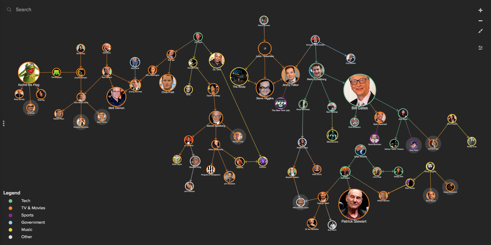
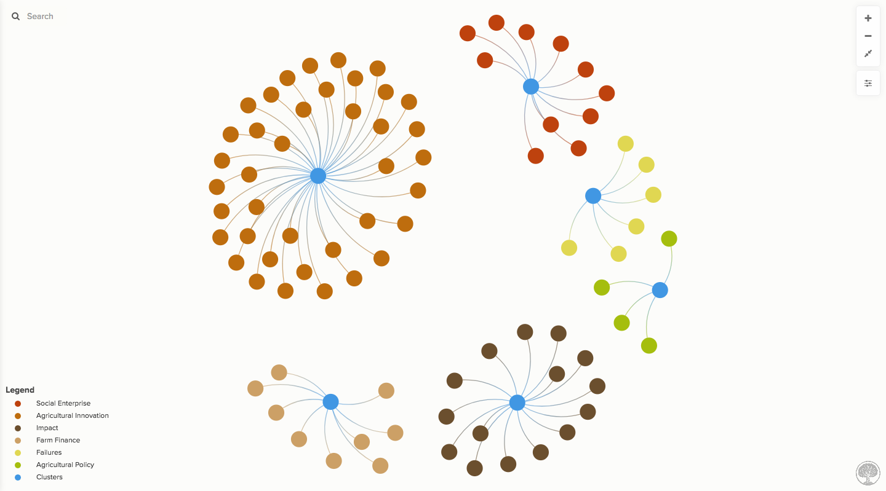
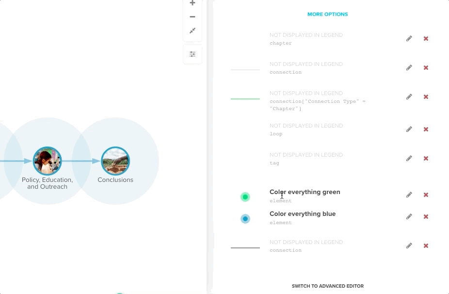

# Data-driven decorations

When you're visually decorating your maps in Kumu (e.g. color-coding, changing shapes and sizes, aligning text, etc.), **data-driven decorations** are usually the most efficient way to do so.

However, data-driven decorations is a feature you may not have come across in other graphic tools you've used. This guide will help with the learning curve!

In this guide, you'll find:

* [Defining "data-driven decorations"](data-driven-decorations.md#defining-data-driven-decorations)
* [Adding your data](data-driven-decorations.md#adding-your-data)
* [Decorate in the Basic Editor](data-driven-decorations.md#decorate-in-the-basic-editor)
  * [Size by](data-driven-decorations.md#size-by)
  * [Color by](data-driven-decorations.md#color-by)
  * [Shape by](data-driven-decorations.md#shape-by)
  * [Fine-tune your decorations](data-driven-decorations.md#use-decoration-builders-to-create-custom-decorations)
* [Decorate in the Advanced Editor](data-driven-decorations.md#decorate-in-the-advanced-editor)
* [The decorations cascade](data-driven-decorations.md#the-decorations-cascade)

## Defining "data-driven decorations"

Data-driven decorations are rules that tell Kumu how to style your map. Those rules accomplish two tasks:

* Tell Kumu which items (i.e. elements, connections, or loops) the rule should apply to.
* Tell Kumu which visual style should be applied to those items.

Here are some examples of rules you could create:

**All elements should be colored blue.**

1. _Which items?_ All elements.
2. _Which visual style?_ Change color to blue.

**Elements with "Person" in their Type field should have a green shadow.**

1. _Which items?_ All elements with "Person" in their Type field.
2. _Which visual style?_ Add a green shadow.

**Connections' thickness should vary based on the number in their "Strength" field.**

1. _Which items?_ All connections.
2. _Which visual style?_ Scale the connection thickness based on its strength.

**Loops that have something in their "Type" field should be color coded based on that value**

1. _Which items?_ Only the loops that have something in their "Type" field.
2. _Which visual style?_ Assign a color automatically, so that each loop's color corresponds with its type.

Note that these rules are not tied to specific elements, connections, or loops, but instead are designed to act on groups of items, based on data and information inside of their [profiles](profiles.md)—in other words, the rules are all **data-driven**.

Whether you have ten, one-hundred, or even one-thousand elements, the first rule from the list above is going to find every single element and color it blue.

It gets better! Let's say you add some elements and connections to Kumu and apply a few rules, just so you can build a prototype visualization with the data you have on hand. Then, you decide that the prototype looks good, so you load in your full dataset, adding tens or hundreds more elements and connections to the visualization. Good news: **your data-driven rules will automatically apply to all the new items in real time**. No need to re-create every rule from your prototype after you add new data!

All data-driven decorations are completely scaleable—Kumu will apply them to any and all new items you add, whether you're adding new elements, connections, and loops, or just editing the information in existing profiles.

## Adding your data

Each element, connection, and loop has a profile that can be used to store additional information in various fields.


Label, Type, Description, and Tags are all examples of fields. Use these fields to provide additional context for each element and connection, and click **+NEW FIELD** to add a custom field.

After you fill out data in the profiles, you can use the [Basic Editor](../overview/view-editors.md#basic-editor) or the [Advanced Editor](../overview/view-editors.md#advanced-editor) to add decorations.

## Decorate in the Basic Editor

To open the Basic Editor, open your map and click the settings icon  on the right side of the map.

<figure><figcaption><p>Basic Editor</p></figcaption></figure>

You'll see some of Kumu's most commonly used view settings, and the first three—**Size by,** **Color by,** and **Shape by**—can help you create basic decorations.

### Size by

**Size by** allows you to scale the size of your elements based on numbers stored inside them. For example, if you have a map of organizations, you could create a field called "Net Assets" and fill out the numbers for each element. Then you can use the Basic Editor to scale the size the organizations according to their Net Assets, allowing you to quickly compare everyone's resources.



Don't like the default sizes? Click the expand icon next to the **Size by** dropdown to fine-tune your sizing options.

In this example, we sized people by the number of views they received on their videos of the ALS ice bucket challenge:



Note that if you don't have any fields with numbers, the **Size by** dropdown menu won't have any options in it. If you don't have this kind of data available, try using Kumu's [Metrics](metrics.md) feature to create some!


Are your fields with numbers not showing up in the Size by dropdown? Try [changing the field type to "Number"](fields.md#customize-a-field).


### Color by

**Color by** allows you to color-code your elements based on any field. Select a field from the dropdown, and any elements that have data in that field will be colored!



Don't like the default colors? Click the expand icon next to the **Color by** dropdown to fine-tune your coloring options. This example colors by Element Type using the `bujumbra` scale:



The default color scale, `neon2`, can support seven different colors. If you need more colors (for example if you have 10 or 11 different element types), [check out our color reference](color-reference.md) to find a scale that will work for your data.

If you color by a multi-pick field like Tags, Kumu will color code your elements with flags (colored arcs around the outside of your elements). Each flag represents one of the possible values in the multi-pick field.


To learn more about flags, [read the full guide](flags.md).

### Shape by

**Shape by** allows you to shape your elements based on any field that can hold only one value. Select a field from the dropdown, and any elements that have data in that field will get a new shape!

<figure><figcaption></figcaption></figure>

To learn more about shapes, [read the full guide](shapes.md).

### Use decoration builders to create custom decorations

If you need more precise control over the size and color of your decorations, you can choose either of the last two options on the list.&#x20;

Select **Decorate elements** to bring up the Decoration Builder for elements.


Or, select **Decorate connections** to bring up the Decoration Builder for connections.


Use the dropdown menus at the top of the builders to choose which elements or connections you are decorating. The options are:

* Decorate all elements/connections
* Decorate custom selection
* Decorate selected elements/connections
* Decorate similar elements/connections

Note that the last two options won't appear in the dropdown menu unless you selected one or more elements/connections _before_ you opened up the Decoration Builder.

If you chose to decorate a custom selection, you can use the tools below the first dropdown menu to build your custom selection. For example, you can set the three boxes to `Element Type` `is` `Person` to tell Kumu that you are only decorating elements who have the type "Person" in their [profile](profiles.md).

After you have built your selection, feel free to play with all the decoration options to find a visual effect that brings insight to your map!


Click the **Done** button to apply your decoration, and if you don't like the way it looks, just find the decoration rule in the [existing decorations](../overview/view-editors.md#existing-custom-decorations) section of the Basic Editor, and click the pencil icon to edit it.

<figure><figcaption><p>Custom decorations</p></figcaption></figure>

You can also add your decorations to the legend by filling out the **Legend** box at the bottom of the Decoration Builder. For more information on legends, [check out the full legends guide](legends.md).

## Decorate in the Advanced Editor

If you've seen or used [Cascading Style Sheets (CSS)](https://developer.mozilla.org/en-US/docs/Web/CSS), decorating in the Advanced Editor will look and feel very familiar.


If you haven't seen or used CSS, don't worry! Most Advanced Editor code follows the same straightforward pattern:

```scss
selector {
    property: value;
}
```

`selector` can be replaced with any valid [selector](selectors.md), and you can read our [property reference](property-reference.md) to find documentation on `properties` and their possible `values`.

For example, if you were mapping a network of politicians, you could add a field called "Political Party", fill out the data for each element, then use this code to add a few decorations:

```scss
element ["Political Party"] {
    size: 40;
    border-width: 2;
}

element["Political Party"="Democrat"] {
    border-color: blue;
}

element["Political Party"="Republican"] {
    border-color: red;
}
```

The first section, starting with `element ["Political Party"]` changes the size and border width of all elements with any value in the "Political Party" field. The section section, which refines the selector to `element["Political Party"="Democrat"]`, gives the Democrats a blue border. The third section changes the selector again to target Republicans, then gives them all a red border.

There's much more you can do with the Advanced Editor—it's one of the most powerful tools in Kumu! [Read the full Advanced Editor guide](../overview/view-editors.md#advanced-editor) to learn more.

## The decorations cascade

Decorations are applied in a cascading order. If you're decorating via the Basic Editor, this means that your most recently created decorations can override your older decorations. For example, if you save a decoration that makes half of the elements blue, then you add another decoration that makes all of the elements green, your end result will be a map full of green elements. The second rule you created will override the first rule.

You can click and drag decorations in the [existing decorations](../overview/view-editors.md#existing-custom-decorations) section of the Basic Editor to reorder them, changing which rule gets applied in the end.



If you're decorating via the Advanced Editor, Kumu will read and apply your decoration code from top to bottom. In the example below, all elements will first be colored blue (`#428cba`), but then will be changed to green (`#5cb85c`).

```scss
/* Color everything blue */
element {
  color: #428cba;
  shadow-color: #428cba;
}

/* Color everything green */
element {
  color: #5cb85c;
  shadow-color: #5cb85c;
}
```

If you're using [direct decorations](direct-decorations.md), keep in mind that direct decorations don't follow the rules of the cascade—they always override data-driven decorations.
