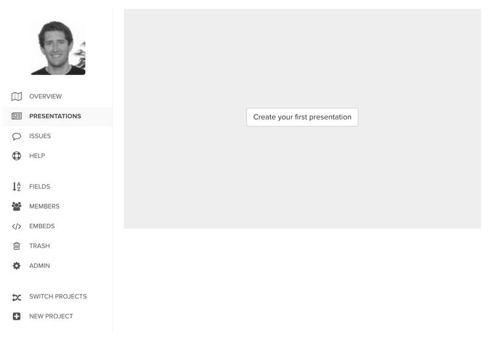
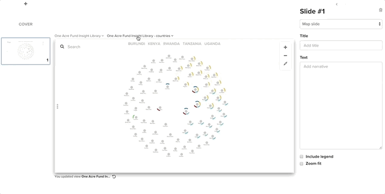

# Presentations

Presentations combine the best of PowerPoint, Prezi, and Kumu into one easy-to-use tool. Combine text, video, images and maps into a single, engaging presentation that anyone can access via URL.

## Create a presentation

Presentations can be accessed through the main menu of your project. When you create a new presentation, you'll land on a title slide, to which you can add a title, subtitle, and background image.

Use the plus button in the upper left corner to add a slide. After the title slide, your added slides can be one of several types:

* Title
* Map
* Text
* Image
* Embed

### Title slides

Title slides are useful when you want to signal the start of a new section in your presentation. They let you add a nice splash image with some overlayed text:

### Map slides

A map slide is any combination of a map and a view. You can choose to have the slide zoom fit by checking the corresponding box, or you can create just the zoom you'd like but zooming in or out.

On a map slide, you can use the dropdown menus above the slide to choose which map and view will be applied. You can pick any map or view in your project.

You can also activate focus or filter for a given map slide, and Kumu will remember those settings. This is a great way to unfold a map step-by-step for your readers.

### Text slides

Text slides can include both a title and content. The content section supports markdown so you can also include images and other basic formatting (widgets aren't supported though).

### Image slides

As you might expect, image slides allow you to upload an image to be displayed full screen on a slide. They're particularly useful for bringing in images of graphs or charts created outside of Kumu. You can also choose to include a title.

### Embed slides

Embed slides are for interactive web content and support embeds from over [300 different providers](http://embed.ly/providers). Just add the URL of the content you'd like to embed.

## Publish a presentation

Once you're finished creating your presentation, click Save and Exit the presentation builder. Click "Publish" to publish the presentation and choose whether you'd like to make the presentation public (unless your project is public in which case your presentation is automatically public) or if you'd like to make it even more secure by adding a password.

After you publish, Kumu will give you a link that you and your audience can use to view your presentation.


**Note:** If you've already published your presentation but make updates to your Kumu map afterward, be sure to click 'Publish' again, and then select 'Update presentation' to reflect the changes.


Want to skip your title slide when you view the presentation? Just add `/embed` to the end of the presentation's link (only supported for public presentations, not private ones).

## Embed a presentation

Presentations can also be embedded just like any other Kumu embed: as an `iframe` on a web page. To get your `iframe` embed code, just publish your presentation, and Kumu will generate the code for you automatically:

Copy/paste the code onto your website, and you're visitors will see a fully interactive Kumu presentation!

## Autoplay a presentation

If you want your presentation to automatically advance to the next slide, add an `autoplay` parameter to the URL. This parameter specifies the number of seconds to wait before advancing to the next slide.

For example, if your presentation URL is `https://you.kumu.io/presentation` and you want it to automatically advance each 10 seconds, then you would use `https://you.kumu.io/presentation?autoplay=10`.

If your presentation is private and has a URL like `https://you.kumu.io/presentation?token=123` and you want it to advance each 10 seconds, then use `https://you.kumu.io?token=123&autoplay=10.`
