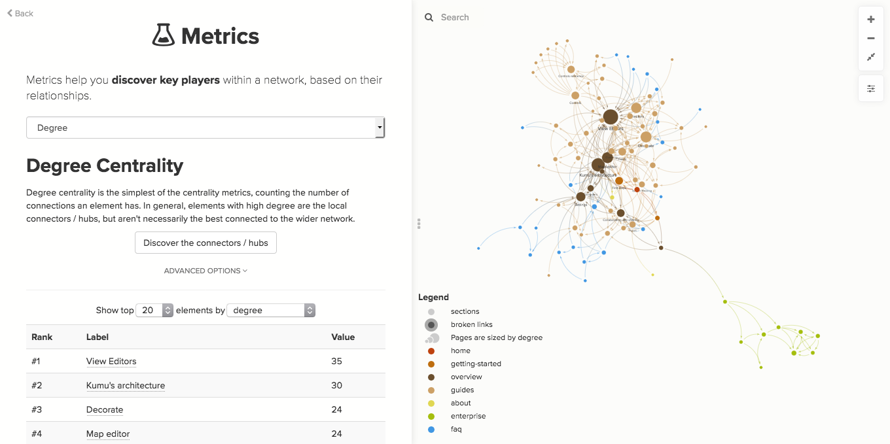
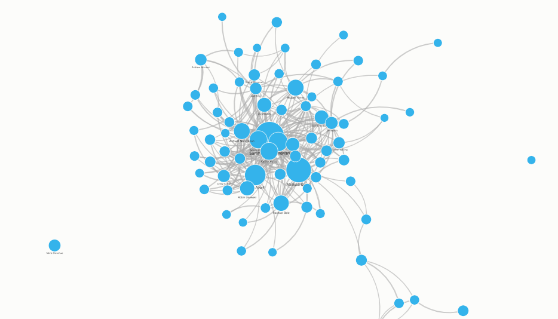
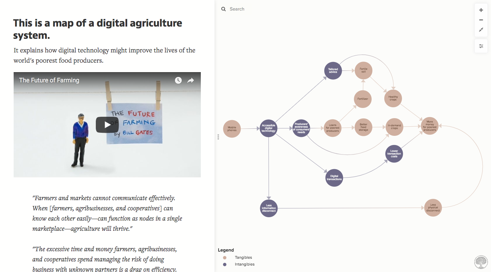

# SNA / Network Mapping

This guide walks you through the basics of network analysis using Kumu. We'll walk through four parts:

1. [Collecting the data](sna-network-mapping.md#collect-the-data)
2. [Getting the data into Kumu](sna-network-mapping.md#get-the-data-into-kumu)
3. [Using Metrics to analyze your network](sna-network-mapping.md#use-metrics-to-analyze-your-network)
4. [Helping others to understand your map](sna-network-mapping.md#help-others-understand-your-map)

Looking for more background about network analysis before you get started? Check out [Social Network Analysis Made Easy](https://speakerdeck.com/jeffcmohr/social-network-analysis-made-easy):



## Collect the data

Data can be collected with a survey, pulled from existing data sources, or populated from your own personal knowledge.

#### Surveys

Surveys ask participants both relational and demographic questions. There are a number of both free and paid tools for survey analysis:

* [Google Forms](https://docs.google.com/forms) (Free)
* [Survey Monkey](https://www.surveymonkey.com/) (Free & Paid)
* [Survey Gizmo](https://www.surveygizmo.com) (Free & Paid)

You can also find survey tools built specifically for social network analysis, for example, [sumApp](http://greaterthanthesum.com/sumapp/), [Polinode](https://polinode.com/), and Kumu's sister product [Weavr](https://weavr.app/about).

Spend time thinking deeply about the questions in your survey. You can ask open-ended questions:

* Who do you work with?
* Who do you turn to for new ideas?
* Who do you turn to for advice?

Or you can ask questions about specific individuals:

* How does working with this person affect your energy levels?
* How many times have you interacted with this person in the last 7 days?

Each of the various relational questions get at a different kind of network. It may be a network of trust, idea sharing & innovation, collaboration, or any other relationships that are important. Here are the three questions from the sample survey:

* **Information Sharing Network** - At least twice in the last month, have you received information from this person that you need to do your job?
* **Problem Solving Network** - At least twice in the last month, have you gone to this person for help with technical work-related problems?
* **Support Network** - At least twice in the last year, have you gone to this person for help with a difficult situation at work?

#### Existing data sources

Sometimes you'll already have access to the type of data needed to run a social network analysis. You might use email traffic, lists of "friends" or "followers" from a social network, information about board membership, or even data from your CRM platform.

The key here is to be both creative and honest about what the data represents. For example, how helpful is the fact that someone is a "friend" of yours on LinkedIn? Have you ever accepted a connection to someone you didn't really know all that well? (We're definitely guilty of this!)

A rule to remember: when the data is easy to access or already collected, be thoughtful and intentional about what story you want to tell and which pieces of the data you want to visualize.

#### Personal knowledge

For certain networks, it's not plausible to collect information via surveys, and you don't have data lying around. In those cases, it's often best to rely on personal knowledge of who knows whom—or even crowdsource this information by pulling together a team of people from the network and building out the links one by one.

When you're taking this approach, your dataset will usually be smaller than that dataset you can get from a survey or an existing data source. That's okay! You can still use Kumu to create a great visualization, and if you plan to expand your data in the future, you can build a proof-of-concept map in Kumu that will be ready to grow along with your dataset.

## Get the data into Kumu

The first step, before you can get the data into Kumu, is to [sign up for an account](https://kumu.io/join) and [create a new project](https://kumu.io/new). If you're not sure which account type is right for you, check out our [full guide on accounts and plans](../overview/accounts-and-plans.md).

Once you have your new project open, you can get the data into Kumu in one of two ways: **importing a spreadsheet** or **building by hand**. For more information on imports, [check out our imports guide](import/). If you're building your map by hand, [check out our First Steps guide](../getting-started/first-steps.md#build-your-map-by-hand) for more guidance.

There are a few subtleties to how you structure your data for easiest use within Kumu. We've laid out some of those below:

**Use connection type to differentiate relationships among people**

Say you ask two questions on your survey: one that asks questions getting at the relationships that represent the **trust** network and another that probes for the relationships that represent the **innovation** network. When structuring your data, use "trust" or "innovation" as the connection type for each connection, and you'll be able to quickly switch between the "trust" and "innovation" network in Kumu using [filters](filter.md).

**Element types make two (or more) mode networks a cinch**

Sometimes you're looking to understand more than just how people are connected to each other. You may want to include organizations, projects, alma maters, and more. Simply differentiate these elements using the element type field and you can easily filter them as needed.

**Don't forget about the power of clustering!**

[Clustering](clustering.md)) makes it easy to turn information stored in the [profile](profiles.md) of any element into a dynamic network. Storing information about the organization someone works for within the profile? Use clustering to then transform that data into explicit connections on your map. This can be a big time saver and value-add if you don't already have connection data created.

## Use Metrics to analyze your network

Social network analysis metrics provide clues to tell you who may be playing important (or not so important) roles across your network. For example:

* **Degree** counts the number of connections attached to each element. Useful for identifying hubs in your network or for predicting single points of failure.
* **Betweenness** tells you how many times a given element is the bridge (or bottleneck) between other elements in the network.
* **Closeness** tells you how close one element is to all other elements in the network. Useful for identifying which elements can quickly spread good (or bad) information or effects.

To learn how to calculate these metrics and more in Kumu, check out our [full guide on metrics](metrics.md).

## Help others understand your map

At this point, you should have a basic network visualization in Kumu, with valuable information (including metrics) stored in the profiles of each item on the map. Now, it's time to use a few of Kumu's most powerful tools to help other people understand your map.

#### Untangle the "hairball"

Often, when you visualize a complex network, it looks like a "hairball"—a tangled-up mess of data that isn't very insightful, like this map:

If you have this problem, you can use Kumu's layout settings to spread the map out a bit. Here's what the map looks like after applying the "hairball" layout setting:

It's much less dense, and when you zoom in, it's much more readable! To learn how to change layout settings on your map, [check out our guide on default settings](default-view-settings.md).

If your network looks like a hairball, you can also use Kumu's **focus** feature to focus on smaller pieces of the network, expanding and contracting your focus with the click of a button. To learn more about focus, [check out the full guide](focus.md).

#### Decorate your map

In Kumu, decorations are one of the best ways to guide your readers through your map. Most people use decorations to change the size and color of elements and connections based on the information their profiles—for example, this map of companies and their relationships uses colors to indicate industry (Higher Education, NGO, Consulting, etc.) and size to represent the betweenness metric:

But that's just the tip of the iceberg! To learn how to do this and more with decorations, [check out the full guide](decorate.md).

#### Share your map

Sharing your map can be as simple as sending a [shareable link](share-and-embed.md) to your readers, but there's no guarantee that they'll be familiar with network maps, let alone how to read and draw insight from one. Depending on your audience, you might want to use **map overviews** or **presentations** to add the right amount of additional context and reading instructions.

Map overviews can be added to the [side panel of the map editor](../overview/map-editor.md#side-panel), and they're a great tool when you need to provide just a few paragraphs of information, or perhaps an embedded video.

If you have a lot of information to give to your readers, or many different views of your map that you want them to see, try [creating a presentation](presentations.md). Presentations in Kumu can seamlessly walk readers through different sections or views of your network, slide by slide.



For more information on sharing Kumu maps or collaborating with others, [check out the full guide](../overview/collaboration.md).

Still have questions? Don't hesitate to [ask for help](../about/where-can-i-get-help.md)!
