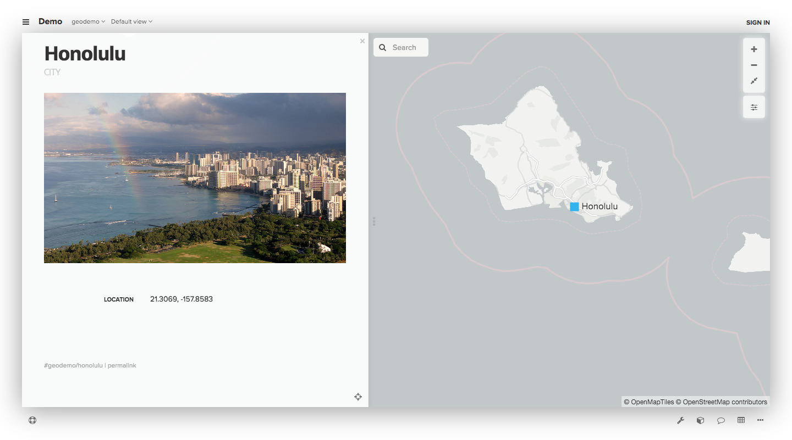
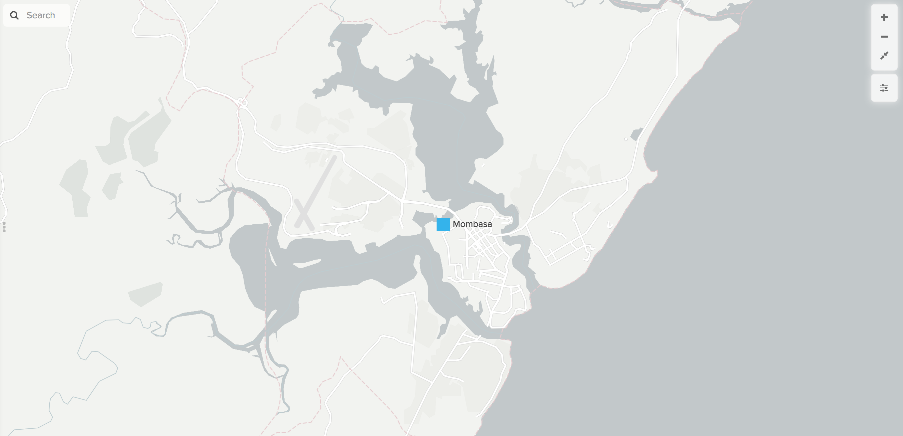

# Geo template

The **geo template** lets you build your visualizations on top of geographic maps.




In Kumu Enterprise, the geo template will not work out of the box—first, you need to configure geocoding. For more information, [see the Configuration guide](../../enterprise/configuration.md#geocoding).


## Apply the Geo template using the Basic Editor

To apply the Geo template using the Basic Editor:

1. Click the settings icon  on the right side of your map to open the Basic Editor.
2. Click **MORE OPTIONS** and select **Customize view defaults** from the list.
3. Scroll down to the **General settings** section.
4. In that section, you can use the Template dropdown menu to select the geo template. Move back to the main Basic Editor panel, then click **SAVE** to finish the process.

## Apply the Geo template using the Advanced Editor

You can activate the geo template by opening the Advanced Editor (keyboard shortcut: press `.`) and adding `template: geo;` to the `@settings` block, like so:

```scss
@settings {
    template: geo;
}
```

## Place your elements

Once you have activated the geo template, you can assign location data to your elements to place them on the geographic map.

Kumu's flexible geocoding engine will understand many types of location data, including mailing address, city and state, or even just a country. You can also provide latitude and longitude values using the "latitude, longitude" format.

If you are using the "latitude, longitude" format, don't include the degree symbol, and don't include the cardinal direction. For example, the latitude, longitude of Honolulu, Hawaii is **21.3069° N, 157.8583° W**, but it should be entered in Kumu as **21.3069, -157.8583**.



Note that latitudes in the Southern hemisphere and longitudes in the Western hemisphere are negative numbers.

If you already have your location data in the map and don't want to duplicate it in a new field name "Location", don't worry - you can use the `geo-location` property in the `@settings` block to tell Kumu where your location data is:

```scss
@settings {
  template: geo;
  geo-location: "zipcode";
}
```

And if the default geocoding results aren’t accurate, you can scope them to a specific region using expressions. For an element with something like "Main Street" in the `location` field, the addition of `, Hawaii` would help Kumu know which Main Street you're talking about:

```scss
@settings {
  template: geo;
  geo-location: "{{location}}, Hawaii";
}
```

Note that your location field should be wrapped in two curly braces if you are scoping the results.

## Pick your map style

You can use the `geo-style` property to pick between these different map styles:

#### `geo-style: auto`



Use `geo-style: dark` for a dark version of the `auto` map.

#### `geo-style: streets`


#### `geo-style: satellite`


**Good to know:**

* Geo maps cannot be exported to PDF or PNG.
* If you leave the location field blank on an element, it will get placed at 0° latitude, 0° longitude (in the Atlantic Ocean, south of Ghana).
* If two elements have the exact same location, they will stack on top of each other and might be difficult to see.
* You can use different types of location data to place your elements, even in the same map, as long as all the data is stored in the same field.
* Screenshots and PDFs are not currently supported for geo.
* By default, the geo template limits you to squares and straight lines, but if you want to test out the full range of decorations (circles, borders, curved lines, flags, etc.), add `renderer: canvas;` to your `@settings` block.
* You can use the `scale-max` and `scale-min` properties to adjust the minimum and maximum allowed zoom levels for your readers. [See the settings reference](../settings-reference.md) for more guidance.
