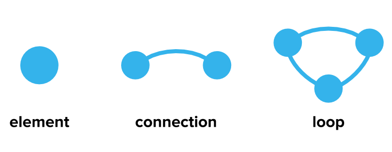
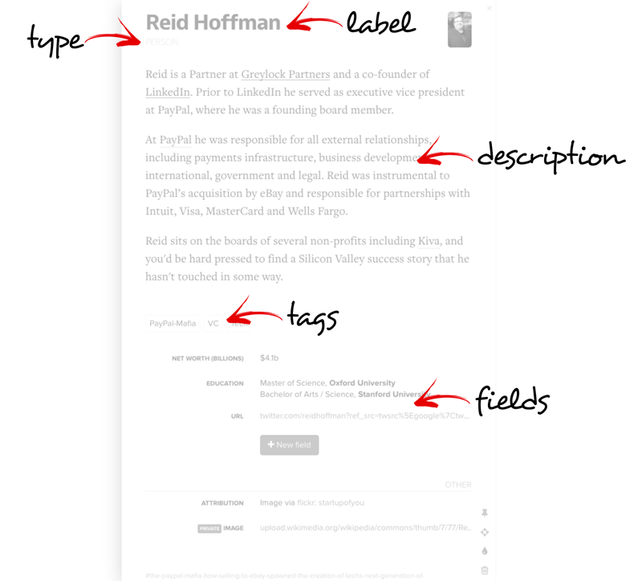

# Kumu's architecture

We've designed Kumu from the ground up to be a powerful, flexible mapping machine, capable of mapping complexity of all kinds. Through that process, we've settled on a specific **architecture**—a way of organizing and visualizing data and information—that makes it possible to create many different kinds of maps.

System maps, network maps, stakeholder/actor maps, community and asset maps, mind maps, concept maps...the list goes on!

In this guide, we'll explain each of the building blocks that make up Kumu's architecture. Take 10 minutes to read through and learn the difference between each building block—it will be really helpful in the long run!



#### Jump to a section

* [Elements, connections, and loops](kumus-architecture.md#elements-connections-and-loops)
* [Fields](kumus-architecture.md#fields)
* [Projects](kumus-architecture.md#projects)
* [Maps](kumus-architecture.md#maps)
* [Views](kumus-architecture.md#views)
* [Trash](kumus-architecture.md#trash)

## Elements, connections, and loops

In Kumu, you can use **elements**, **connections**, and **loops** to represent your system or network. Visually speaking, elements are circles, connections are lines between the elements, and loops are groups of two or more connections.

You can use these visual components in all kinds of different ways, but here are some common uses that we see:

| Elements                                        | Connections                                                                           | Loops                       |
| ----------------------------------------------- | ------------------------------------------------------------------------------------- | --------------------------- |
| Factors in a system (causes and effects)        | Cause-and-effect relationships                                                        | Causal loops                |
| Stocks                                          | Flows                                                                                 | Sub-systems                 |
| Decisions, chances, and ends in a decision tree | Paths along the decision tree                                                         | Multi-part decisions        |
| Steps in a process                              | Paths from one step to the next                                                       | Sub-processes               |
| People                                          | Interpersonal relationships                                                           | Sub-networks or communities |
| People & organizations                          | Connect people to the organizations they're affiliated with                           | Sub-networks or communities |
| Authors & books/articles they've co-authored    | Connect authors to their books/articles                                               | Sub-networks or communities |
| Stakeholders & areas of interest                | Connect stakeholders to the areas they're interested in                               | Sub-networks or communities |
| Funders, non-profits, and population groups     | Connect funders to non-proftis, and connect non-profits to the populations they serve | Sub-networks or communities |
| Companies and sectors/industries                | Connect companies to their sectors/industries                                         | Sub-networks or communities |

For instructions on how to create elements, connections, and loops in Kumu, check out the [Building your first map](../getting-started/first-steps.md#build-your-first-map) section of our First Steps guide.

## Fields

Each element, connection, and loop can hold additional rich information about the item. This information is stored in **fields**, which have two components: a name, and a value.

The most basic field is named "Label". Any value you add to an element's or loop's "Label" field will be displayed as a text label underneath or on top of that element or loop. (Connection labels are hidden by default, but it's possible to show those labels as well). In addition to "Label", there are three other pre-named fields:

1. **Type** — a field designed to help you separate your items into categories. For example, you elements might have "Person" or "Organization" in their type field, to clarify what the element represents.
2. **Description** — a field designed to hold longer descriptions of an item. Descriptions can include multiple paragraphs, and even images and videos.
3. **Tags** - a field designed to hold multiple values that each describe your item in a different way. For example, a connection between a person and a non-profit might have "Strong relationship", "Board Member", "Donor", and "Advocate" all stored as separate values in the Tags field, adding rich detail to the person's relationship with the organization.

Beyond those four pre-named fields, you can create as many custom fields as you want—you can have a "Website" field, a "Net Assets" field, a "What do you want to learn?" field, etc. Fields can be created and edited using [profiles](../guides/profiles.md):

For more information on fields and how to create and customize them, [check out our full guide on fields](../guides/fields.md).

## Projects

**Projects** are the top level of Kumu's architecture. Think of projects as a "buckets" that contain everything defined above: elements, connections, loops, fields, views, and maps.

Within a project, you can have both Maps and Views.&#x20;

There's an important distinction to be made between a project, a map, and a view: the project contains the master list of elements, connections, and loops, while the map and the view simply borrow a collection of data from that list. If you edit an element, connection, or loop while working on a map or view, you're not just editing the map or view—you're actually editing the project's master list.

If you ever find yourself creating multiple maps within one project, it's very important to remember that concept, because when you edit an item (for example, change an element's Label, Type, or any other field value) those changes will be applied to **every other map** that is borrowing the same item from the project's master list.

If you only have one map in your project, don't sweat this detail!

Projects can also remember a few more important things:

* The project's privacy level (public or private)
* Any [presentations](../guides/presentations.md) you have created to share your work
* Any [contributors](collaboration.md) that can edit your project
* Any [add-ons](../guides/add-ons.md) that have been installed on the project
* Any [license](../guides/licensing.md) you have added, to tell people how they can or cannot share or re-use your work

Click on the .png>) menu in the top-left corner of your project to change any project settings.

You create new projects and see all your existing projects on your [dashboard](dashboard.md).

&#x20;

## Maps

In Kumu, a **map** is a collection of elements, connections, and loops—each map can remember a full list of which elements, connections, and loops should be included.

In addition, a map can remember specific positions for all of its elements, and it can remember the positions of any labels that represent loops.&#x20;

A map can also remember a few default settings:

* **Default view** — the view whose rules will be applied to the map by default.
* **Default element behavior** — tells the map whether new elements should stay in a fixed position by default, or float around, relying on their connections to pull them into a final position
* **Default connection direction** — tells the map whether new connections should be "Directed" (arrow on one end), "Undirected" (no arrows), or "Mutual" (arrows on both ends) by default

Finally, a map can remember a rich description about itself, called a "Map Overview", which Kumu displays next to the map so your audience can read it:


To create a new map: click on the first dropdown next to the project title in the top-left corner of your screen, and choose **+ NEW MAP.**&#x20;


For more info on how to build the basic structure of your map, check out our [full guide on the map editor](map-editor.md).

## Views

A **view** is a collection of rules that affect the visual appearance of your elements, connections, and loops.

There are a lot of different kinds of rules that you can create. For example:

* All elements with "Person" in their Type field should be colored blue.
* All connections with "Very Weak" in their Tags field should be filtered out (temporarily hidden).
* Connections should be drawn between all the people who have the value "Finance" in a field named "What do you want to learn?".

Note that these rules are not tied to specific elements, connections, or loops, but instead are designed to act on groups of items, based on data and information inside of them—the rules in your views are all **data-driven**. Whether you have ten, one-hundred, or even one-thousand elements, the first rule from the list above is going to find _every single element_ with "Person" in the Type field and color it blue.

It gets better! Let's say you add some elements and connections to Kumu and apply a few rules, just so you can build a prototype visualization with the data you have on hand. Then, you decide that the prototype looks good, so you load in your full dataset, adding tens or hundreds more elements and connections to the visualization. Good news: **your view rules will apply to all the new items**. No need to re-create every rule from your prototype!

All view rules are completely scaleable—Kumu will apply them to any and all new data you add, whether you're adding new elements, connections, and loops, or just adding new values to your fields.


To create a new view: click on the first dropdown next to the project title in the top-left corner of your screen, and choose **+ NEW VIEW.**&#x20;


To learn more about building views and creating specific types of rules, check out the guides below. There's a lot to learn about views! But don't feel like you need to learn it all at once. You can get a lot of value out of Kumu without knowing all this information, but this is a great place to return to when you feel ready to take your Kumu skills to the next level.

| Guide                                         | Main idea                                                                                                                      |
| --------------------------------------------- | ------------------------------------------------------------------------------------------------------------------------------ |
| [View editors](view-editors.md)               | Learn your way around the user interfaces that allow you to edit views.                                                        |
| [Decorate](../guides/decorate.md)             | Change visual appearance of items (color, size, pattern, shadow, image, etc.).                                                 |
| [Filter](../guides/filter.md)                 | Temporarily show or hide items.                                                                                                |
| [Showcase](../guides/showcase.md)             | Make certain items translucent, fading them subtly into the background.                                                        |
| [Focus](../guides/focus.md)                   | Focus on a single element, hiding everything else. Then, expand outward to reveal more elements and connections, step-by-step. |
| [Cluster](../guides/clustering.md)            | Connect elements automatically, based on the information in their fields.                                                      |
| [Bridge](../guides/bridge.md)                 | Connect elements based on their "mutual friends" (elements they're both connected to).                                         |
| [Imported views](../guides/imported-views.md) | Import rules from another view, so that you don't have to re-build them.                                                       |
| [Controls](../guides/controls.md)             | Customize the way people interact with your map.                                                                               |
| [Layouts](../guides/layouts.md)               | Change the way Kumu positions your elements.                                                                                   |

## Trash

Last but not least, Kumu's architecture includes the **trash**.

The trash is a list of all the elements, connections, and loops that, once upon a time, were the the lifeblood of your system map, the all-powerful hubs of your network map, the social-media-savvy influencers of your stakeholder map...until you realized that the data was totally inaccurate, imprecise, full of typos (_\*gasp\*_), or duplicated (_\*shudder\*_), and deleted it using the [little trash can icon](map-editor.md#side-panel) .

All prose aside, the trash is where your project stores the items that have been deleted from every single map. From time to time, you may want to [follow this guide](../faq/how-do-i-delete-data-from-my-project.md) to empty it out!

But, we should give credit where credit is due: the trash is your last line of defense against accidentally deleting data (a.k.a. hard work, time, and effort) from your project. If you ever think that you've deleted something accidentally, and you need to recover it from the trash, [check out this guide](../faq/my-map-disappeared-how-do-i-bring-it-back.md#has-the-data-been-deleted), or just [ask for help](../about/where-can-i-get-help.md), and the Kumu team or community will find a solution.
