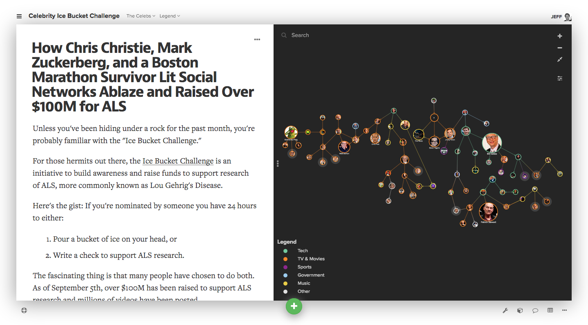
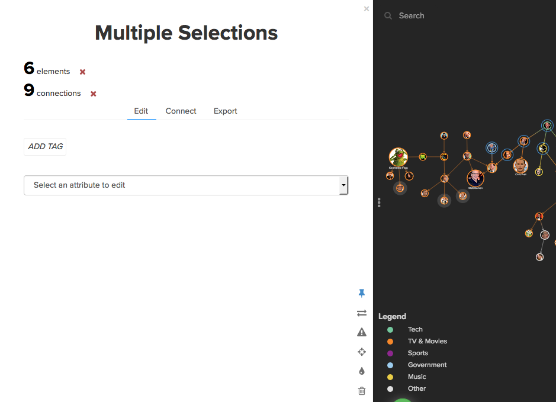

# Map editor

The map editor is where you'll build the basic structure of your [map](kumus-architecture.md#maps).

## Top toolbar

In the upper left of your map editor, you can find the **top toolbar**. First, you'll see a menu icon  , which you can use to access [project settings](settings.md#project-settings). Next to that icon, you'll see the project name, followed by two dropdown menus.

The first dropdown menu allows you to create new maps and navigate to different maps within your [project](kumus-architecture.md#projects). The second dropdown menu allows you to create new [views](kumus-architecture.md#views) and apply different views to the current map.

## Create, rename, duplicate or delete a map

* To create a new map: click on the first dropdown next to the project title in the top-left corner of your screen, and choose **+ NEW MAP.**&#x20;
* To rename a map: click on the first dropdown next to the project title in the top-left corner of your screen, hover over a map, and choose the edit pencil. Alternatively, right-click on any blank space in your map, click on Map, choose Rename Map.&#x20;
* To duplicate a map: right-click on any blank space in your map, click on Map, choose Duplicate Map. **NOTE:** making changes to a duplicate map _may_ affect your original map. Read more about that in [this guide](kumus-architecture.md#projects).&#x20;
* To delete a map, click on the first dropdown next to the project title in the top-left corner of your screen, hover over a map, and choose the trash icon. Alternatively, right-click on any blank space in your map, click on Map, choose Delete Map.&#x20;

## Bottom toolbar

In the bottom right corner of your map editor, you'll see a toolbar with several icons that let you take useful actions within your project.

*  The magic wand brings up a [quick actions](../guides/quick-actions.md) menu that allows you to search for tools, actions, and how-to videos
*  The flask gives you access to [social network analysis metrics](../guides/metrics.md) and [community detection](../guides/metrics.md#community-detection)
*  The chat bubble opens up [Discussions](../guides/discussions.md), where you can chat with your team and attach comments to the map
*  The table brings up Kumu's [Table](../guides/table.md) tool
*  The download icon exposes several [export](../guides/export.md) options
*  The share icon will help you [share or embed](../guides/share-and-embed.md) your project
*  The ellipsis brings up miscellaneous actions, like entering fullscreen or preview mode

## Side panel

Under the top toolbar, you'll see the **side panel**. When you first open your map, or when you click on the background of your map, this side panel will show the Map Overview, where you can add general information about your map to help your readers understand it.


Tip: use [Markdown](../guides/markdown.md) to help you style text in the side panel, and add images and videos.


When you select an individual element, connection, or loop on the map, the side panel will show that item's [profile](../guides/profiles.md).

Inside the profile, you can add and edit information about the selected item. You can also use the icons in the bottom right of the profile to:

*  Attach a comment to your selected item
*  Pin an element in a [fixed position](../guides/layouts/fixed.md)
*  Change [connection direction](../faq/how-do-I-add-arrows-to-my-connections.md)
*  Add [delay markings](../guides/system-mapping.md#add-delay-markings)
*  Activate [focus](../guides/focus.md)
*  [Decorate](../guides/decorate.md) the item
*  [Delete](../faq/how-do-i-delete-data-from-my-project.md) the item

#### Multiple selections

If you select multiple elements, connections, or loops, the side panel will show the **Multiple selections** tool, which allows you to add information or change information across all the selected items in just one step. It's a big time-saver!

Finally, the side panel is also home to Kumu's Metrics tool. To learn more, check out the [full guide on metrics](../guides/metrics.md).

You can show and hide the side panel by pressing `Tab` on your keyboard or by clicking the three gray dots to the right of the panel:

## Canvas

The star of the show, of course, is the map's canvas, where all of your elements, connections, and loops are displayed. To add new items to the map, click the green button at the bottom of the canvas. For more guidance on building your map, [check out our First Steps guide](../getting-started/first-steps.md#build-your-first-map).

By default, your canvas will have a search bar in the upper left, a zoom toolbar in the upper right, and a settings icon  under the zoom toolbar. If you have added a [legend](../guides/legends.md) to your map, it will appear in the lower left of your map's canvas by default.

Click on the search bar to search across the current map or across all maps. After you click on the search bar, you can also click on the rocket icon  to bring up the [selector](../guides/selectors.md) builder, which is useful when you want to select multiple items based on the information in their profiles. Use the zoom toolbar (or scroll up and down with your mouse/touchpad) to change your zoom level, and click the settings icon to access Kumu's [view editors](view-editors.md).

If you ever want to remove or reposition the search bar, zoom toolbar, settings icon, or legend, [check out our guide on controls](../guides/controls.md).

Happy mapping!
